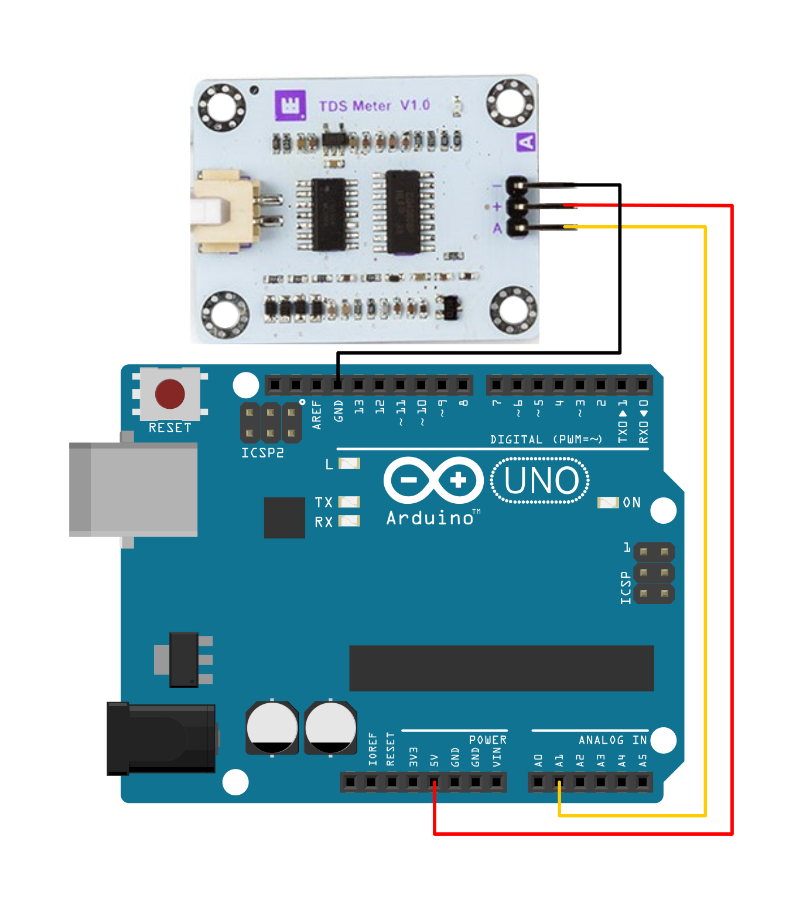

# Whadda TDS (Total Dissolved Solids) WATER QUALITY SENSOR

This example shows how you can use the Whadda TDS (Total Dissolved Solids) water quality sensor module
 (WPM356) with an Arduino® compatible board.

## Library dependencies
* None

## Wiring diagram

## Additional information
  For more information about the Whadda TDS (Total Dissolved Solids) water quality sensor module (WPM356), check the manual available at [whadda.com](https://whadda.com)

